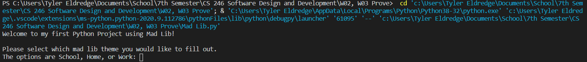

# Overview
My first Mad Lib program using the Python language. 

# Development Environment

* Visual Studio Code
* Python 3.8.5

# Execution

To execute the Mad Lib program: `python Mad_lib.py`

# Useful Websites

* [Python Refrence](https://docs.python.org/3/library/index.html)
